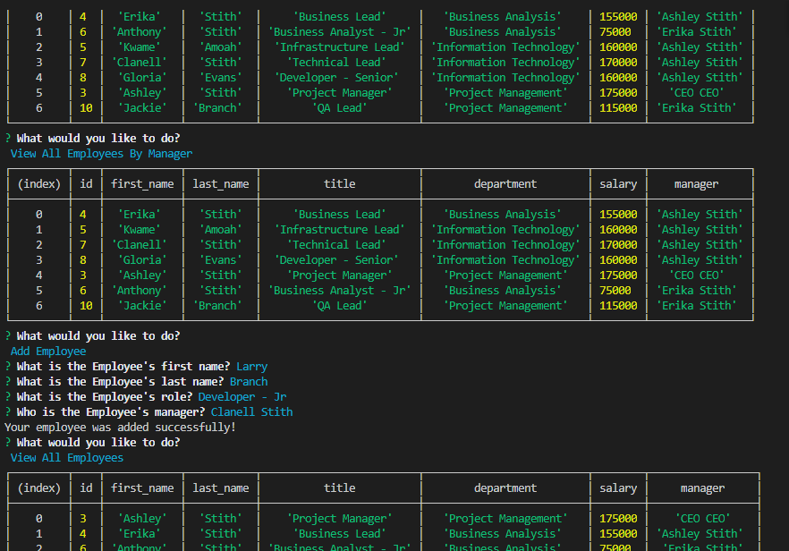

# hw12 employee-tracker, 11 FEB 21 **Extended to 13 FEB 21

#### By Ashley Stith

## Description
This console application allows users to Create - Read - Update - Delete Employee data.  It uses node, inquirer and mySQL to interface and interact with an employees database.  The database includes tables for the Employees, Departments and Roles.  Each table has a primary id key and foreign keys to assist with talking to one another.  There are several actions that a user can do once the application has been launched:

* 'View All Employees' - view all employees stored in the database
* 'View All Employees By Department' - view all employees by department
* 'View All Employees By Manager' - view all employees by manager
* 'Add Employee' - add an employee to the database
* 'Remove Employee' - remove an employee from the database
* 'Remove Department' - remove a department from the database **BONUS**
* 'Remove Role' - remove a role from the database **BONUS**
* 'Update Employee Role' - update an employee's role
* 'Update Employee Manager'- update an employee's manager **BONUS**
* 'View All Roles' - view all roles
* 'View Total Budget By Department' - view total budget (sum of salaries) by department **BONUS**


## Dependencies
The [Inquirer package](https://www.npmjs.com/package/inquirer) is used to prompt the users in the command prompt.

In addition, the [mySQL package](https://www.npmjs.com/package/inquirer) is used to connect with the database.

Finally, the [console.table package](https://www.npmjs.com/package/console.table) is used to display the results in a nice table.

The application is invoked by using the following command:

```bash
node employeeTrackerCode.js
```

## Installation
* Create a `.gitignore` file and include `node_modules/` and `.DS_Store/`
* Install npm dependencies using the following command:
```bash
npm i
```
## Features
* The application has an *EmployeeTracker-schema.sql* file that contains the schema.  Note: sample data is also included in the schema to demonstrate the proper use.

Video demo of the application: *Note: The application may have been slightly updated since recording demo*
[](https://drive.google.com/file/d/1b9-aPhhIyiap4yodQx7JhXBcmJ2Ksn0K/view)

## Known Bugs
Site has no known bugs

## Technologies Used
* node.js
* inquirer
* mySQL

## Contribution Guidelines
Direct link to repository: https://github.com/stithac/hw11-express-note-taker


